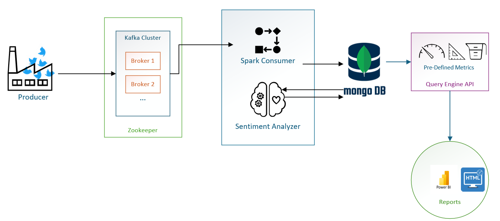
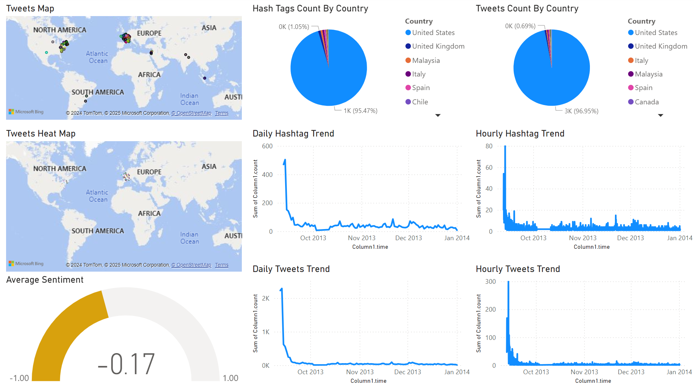
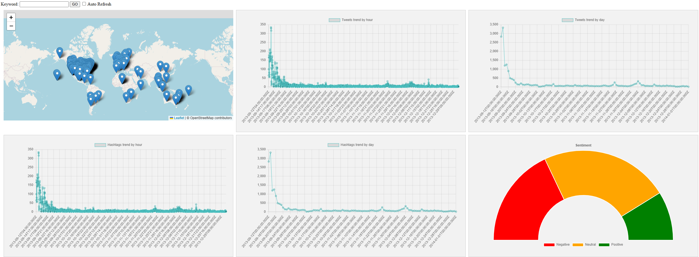

# Tweets Analysis Using Spark Streaming

## Setup

### Install Prerequisites

- Spark
- Scala
- Kafka
- Mongodb
- Nodejs
- PowerBI Desktop (Optional)

### Run

- Run Kafka
  - start zookeeper-server-start KAFKA_INSTALL_LOCATION\config\zookeeper.properties
  - start kafka-server-start KAFKA_INSTALL_LOCATION\config\server.properties
- Run Consumer (Spark)
  - Open the App.scala project and run it.
- Run Producer
  - node src/producer/FileSourceProducer.js DATA_FILE_PATH
- Run Api
  - node src/qengine/Api.js
- Open PowerBI Report/ Html Report

## System Overview

The system consists of the following components:

- Producer (generates tweets).
- Kafka cluster to handle the produced tweets.
- Two spark jobs running concurrently:
  - Consumer that reads from Kafka and parses the values, then saves them to Mongo DB.
  - Sentiment analyzer that reads from Mongo DB, analyzes the sentiment and then sets the value back in Mongo DB.
- MongoDB (stores the tweets with the sentiment that was analyzed)
- Query engine API: exposes pre-defined metric queries for the reports.
- Reports: (Two reports where created one using PowerBI and one using Custom Html)
  

## Pre-Defined Metrics

The query engine API exposes the following predefined metrics (all metrics can be filtered with a keyword):

- Locations: (Gets the locations as latitude and longitude for the tweets)
- Hashtags by country: (Gets the count of hashtags per country)
- Tweets by country: (Gets the count of tweets per country)
- Daily/Hourly hashtag trends.
- Daily/Hourly tweets trends.
- Sentiment gauge.

## Reports

Two sample reports were created:

- PowerBI Report:
  

- HTML report:
  
